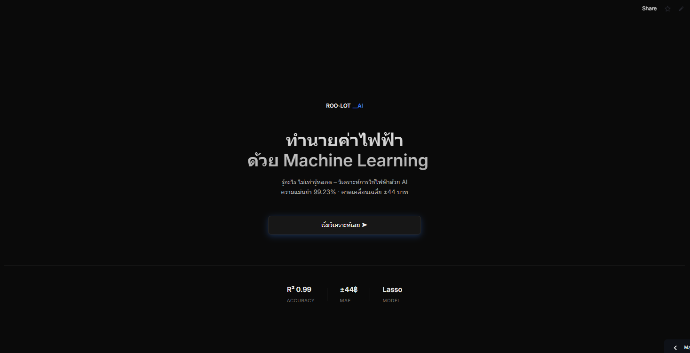
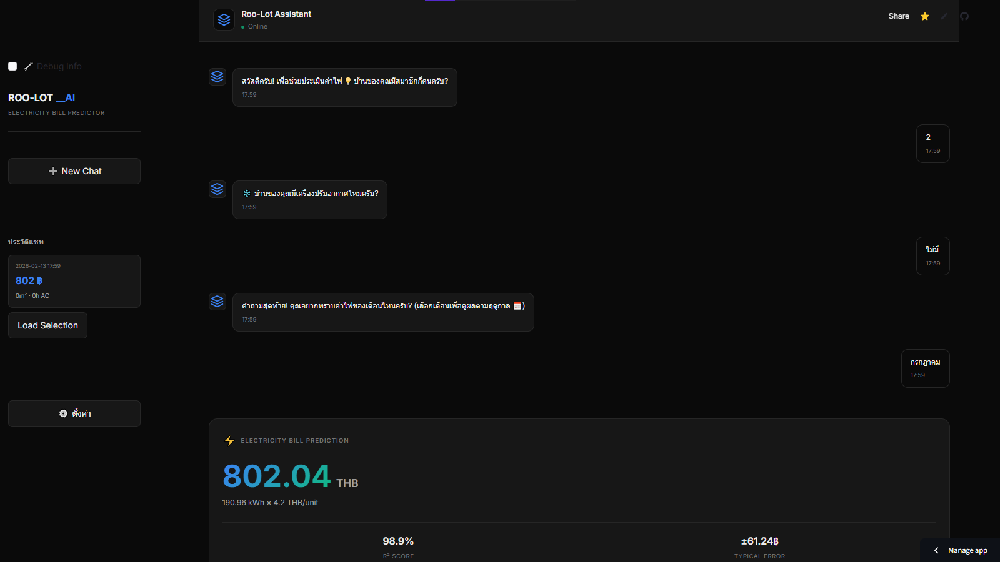

# Roo-Lot: AI Electricity Bill Predictor

## 🎯 Project Overview
Roo-Lot is an AI-powered chatbot that helps predict monthly electricity bills for Thai households. Using a conversational interface in Thai, users can input household size, AC availability, and desired month to get accurate bill estimates. The system uses a Random Forest model trained on household energy consumption data with 98.88% accuracy.

## � Screenshots

### Landing Page

*Modern UI with performance metrics and quick start options*

### Chatbot Interface

*Conversational flow in Thai language with real-time predictions*

## 🚀 Quick Start

### Installation
```bash
# Python 3.11+ required
cd roo-lot
pip install -r requirements.txt
```

### Model Training
```bash
# Train the latest model (Kaggle-aligned features)
python scripts/train_model_kaggle.py
# Output: R² = 0.9888, MAE = 14.58 kWh, RMSE = 18.56 kWh
# Training time: ~2 minutes
```

### Running Web App
```bash
cd roo-lot
streamlit run app_chatbot.py
# Opens at http://localhost:8501
```

## 📊 Performance Metrics

| Model | R² | MAE (kWh) | MAE (THB) | RMSE (kWh) | Training Time |
|-------|-----|-----------|-----------|------------|---------------|
| **Random Forest** | **0.9888** | **14.58** | **61** | **18.56** | 120s |
| Linear Regression | 0.9145 | 1.27 | 5 | 1.61 | 5s |

*Current model: Random Forest with Kaggle-aligned features*

## 🏗️ Project Structure

```
roo-lot/
├── scripts/
│   ├── train_model_kaggle.py    # Current training pipeline
│   ├── train_model.py           # Legacy training
│   └── retrain_v2.py            # Real data retraining
├── utils/
│   ├── model_predictor.py       # Inference engine
│   ├── theme_manager.py         # UI theme system
│   └── charts.py                # Visualization utilities
├── components/
│   ├── landing.py               # Landing page
│   ├── chat_message.py          # Chat UI
│   ├── result_card.py           # Results display
│   └── sidebar.py               # Navigation sidebar
├── conversation/
│   ├── manager.py               # Conversation flow
│   ├── questions.py             # Question definitions
│   └── validator.py             # Input validation
├── tests/                       # Unit tests
├── app_chatbot.py               # Main Streamlit application
├── models/
│   └── electricbills_predict.pkl # Trained model
└── data/
    └── household_energy.csv     # Dataset
```

## 🔬 Technical Details

### Current Model Features
- **household_size**: int (1-10 people, trained on 1-6)
- **has_ac**: boolean (0 or 1) - AC presence only
- **month**: int (1-12) - for seasonal features

### Derived Features (Auto-calculated)
- **season_hot**: 1 if month 3-6 (Mar-Jun)
- **season_rainy**: 1 if month 7-10 (Jul-Oct)  
- **weekend_ratio**: Calculated using 2025 as reference year

### Model Configuration
```python
RandomForestRegressor(
    n_estimators=100,
    max_depth=10,
    min_samples_split=5,
    random_state=42
)
```

### Feature Importance
1. household_size: 68.6%
2. has_ac: 30.5%
3. season_hot: 0.45%
4. weekend_ratio: 0.31%
5. season_rainy: 0.13%

## 💬 User Interface Features

### Conversational Flow (Thai Language)
1. **Landing Page**: Modern UI with metrics overview
2. **Question 1**: "บ้านของคุณมีสมาชิกกี่คนครับ?" (Household size)
3. **Question 2**: "บ้านของคุณมีเครื่องปรับอากาศไหมครับ?" (AC availability)
4. **Question 3**: "คุณอยากทราบค่าไฟของเดือนไหนครับ?" (Month selection)
5. **Results**: Bill prediction with confidence intervals and detailed analysis

### UI Components
- Modern dark/light theme system
- Responsive design for mobile/desktop
- Chat history sidebar
- Quick reply buttons
- Real-time typing indicators
- Detailed result cards with metrics

## ⚠️ Known Limitations

### Model Limitations
- **Synthetic Date Distribution**: Training uses synthetic dates for seasonal features
- **Household Size Extrapolation**: Predictions for >6 people may be less accurate
- **International Data**: Trained on international dataset, may differ from Thai patterns
- **Seasonal Accuracy**: May under-predict by ~15% in hot months, over-predict by ~30% in cool months

### Usage Guidelines
- ✅ Use as **planning estimate**, not exact bill
- ✅ Good for **budget planning** 
- ✅ Allow ±20% margin for safety

## 🧪 Testing

```bash
# Run all tests
pytest tests/

# Run specific test
pytest tests/test_model_predictor.py -v

# Test coverage
pytest --cov=utils tests/
```

## 📚 Documentation

### Key Files
- **Full Report**: `Report ML Project (Roo-Lot).md`
- **Agent Guidelines**: `AGENTS.md`
- **Deployment Checklist**: `STREAMLIT_DEPLOYMENT_CHECKLIST.md`

### External References
- **Kaggle Dataset**: [Household Energy Consumption](https://www.kaggle.com/datasets/samxsam/household-energy-consumption)
- **Model Training**: See `scripts/train_model_kaggle.py`

## 🤝 Contributing

1. Fork the repository
2. Create a feature branch
3. Make your changes
4. Add tests for new functionality
5. Submit a Pull Request

## 📄 License

MIT License

---

**Last Updated**: 2026-02-14  
**Version**: 2.0.0 (Python 3.11 Compatible - Metrics Corrected)  
**Model**: Random Forest with Kaggle-aligned features (R²=0.9888, MAE=14.58 kWh)
