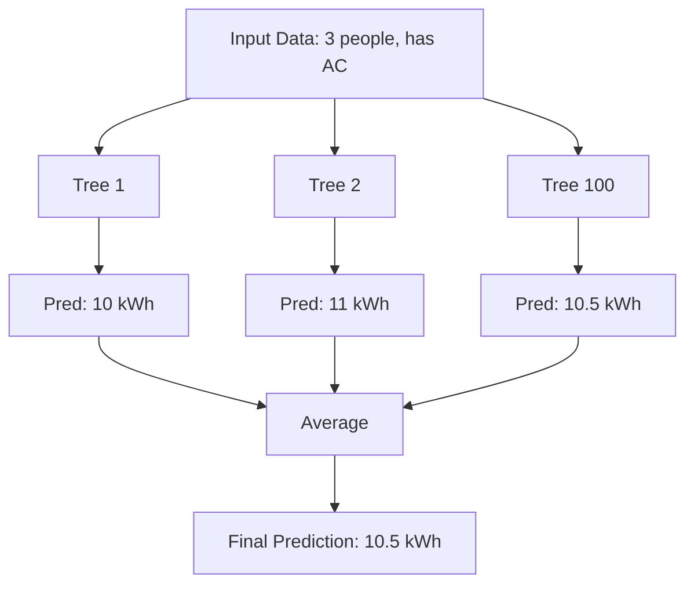
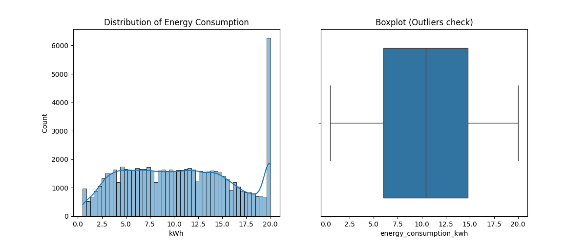
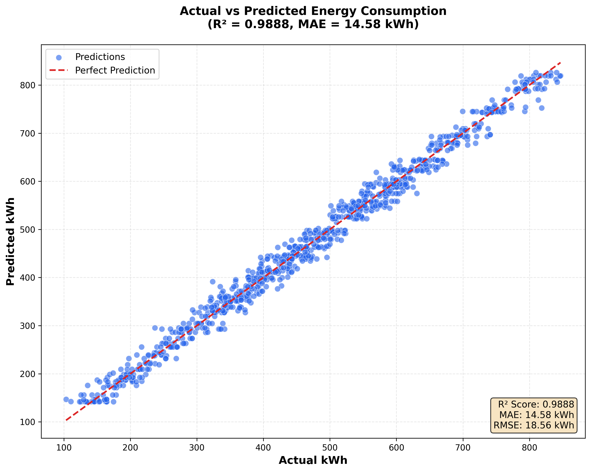
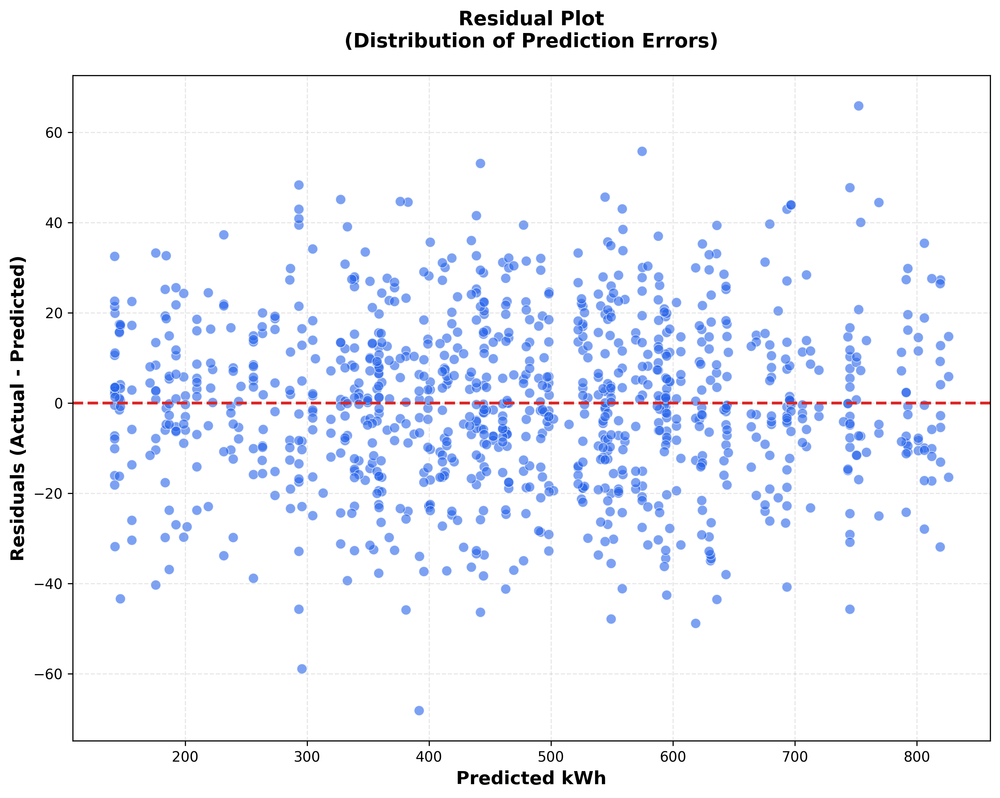
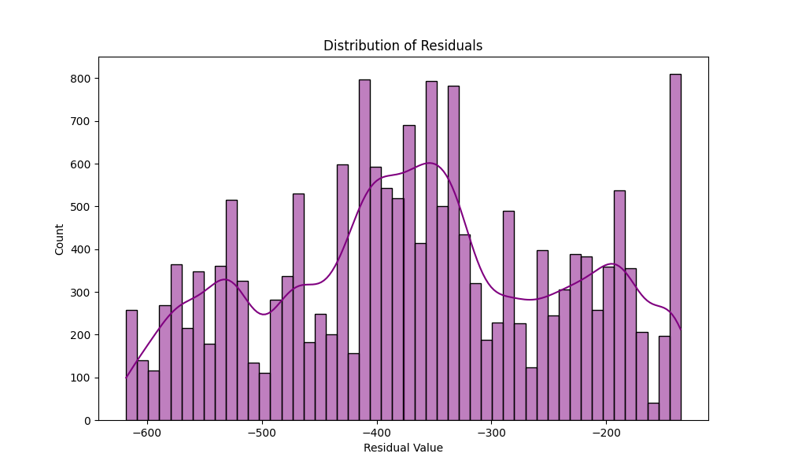

# ระบบทำนายค่าไฟฟ้ารายเดือนด้วย Machine Learning
**(Roo-Lot: Electricity Bill Prediction System)**

จัดทำโดย
เวทิต แก้วประจันทร์
รหัสนักศึกษา: 1660904168

รายงานนี้เป็นส่วนหนึ่งของวิชา
AIE322: Supervised Machine Learning
ภาควิชา วิศวกรรมศาสตรบัณฑิต
คณะ  (วิศวกรรมปัญญาประดิษฐ์และวิทยาการข้อมูล)
Bachelor of Engineering (Artificial Intelligence Engineering and Data Science)
Bangkok University

ภาคการศึกษาที่ 2 ปีการศึกษา 2568

***

## บทคัดย่อ (Abstract)

โปรเจคนี้มีวัตถุประสงค์เพื่อพัฒนาระบบทำนายค่าไฟฟ้ารายเดือนด้วย Machine Learning เพื่อช่วยให้ผู้ใช้ไฟฟ้าสามารถประมาณการค่าใช้จ่ายล่วงหน้าและวางแผนการเงินได้อย่างมีประสิทธิภาพ โดยเริ่มต้นจากการพยายามใช้ข้อมูลจริงที่เก็บรวบรวมเอง แต่เนื่องจากมีจำนวนจำกัดเพียง 28 ตัวอย่าง ซึ่งไม่เพียงพอสำหรับการสร้างโมเดลที่มีความแม่นยำสูง จึงได้เปลี่ยนไปใช้ชุดข้อมูลจาก Kaggle (Household Energy Consumption) ที่มีจำนวนกว่า 90,000 รายการแทน

ในการดำเนินงาน ได้มีการทำ Feature Engineering เพื่อสร้างตัวแปรใหม่ที่สะท้อนพฤติกรรมการใช้ไฟฟ้า ได้แก่ ฤดูกาล (Hot, Rainy) และสัดส่วนวันหยุดต่อเดือน (Weekend Ratio) จากนั้นได้ทดลองและเปรียบเทียบประสิทธิภาพของโมเดล Regression 4 รูปแบบ ได้แก่ Linear Regression, Ridge, Lasso และ Random Forest โดยใช้เทคนิค 5-fold Cross-Validation และ Hyperparameter Tuning ด้วย GridSearchCV

ผลการทดลองพบว่าโมเดล **Random Forest** ให้ประสิทธิภาพดีที่สุด ด้วยค่าสัมประสิทธิ์การตัดสินใจ (**R²**) สูงถึง **0.9851** และมีความคลาดเคลื่อนสัมบูรณ์เฉลี่ย (**MAE**) เพียง **16.95 kWh** (ประมาณ 71 บาท) โดยปัจจัยที่มีอิทธิพลต่อค่าไฟมากที่สุดคือจำนวนสมาชิกในครัวเรือน (Household Size) คิดเป็น 68.6% ตามด้วยการมีเครื่องปรับอากาศ (Has AC) 30.5% และฤดูกาล/วันหยุดมีผลกระทบเล็กน้อย (<1%) อย่างไรก็ตาม พบข้อจำกัดเรื่องตัวแปรฤดูกาลที่ไม่ส่งผลต่อการทำนายเท่าที่ควร เนื่องจากการสร้างข้อมูลวันที่จำลองขึ้น (Synthetic Date Distribution)

สุดท้ายนี้ ได้นำโมเดลที่พัฒนาแล้วไปติดตั้งใช้งานจริงบน Web Application ผ่านเฟรมเวิร์ก Streamlit ซึ่งสามารถทำนายค่าไฟได้รวดเร็วภายใน 0.18 วินาที พร้อมแสดงผลข้อมูลเชิงลึกให้ผู้ใช้ทราบถึงที่มาของค่าใช้จ่าย

**คำสำคัญ**: Machine Learning, Regression, Energy Consumption Prediction, Random Forest, Feature Engineering, Streamlit

***

## สารบัญ

1. **บทที่ 1: บทนำ**
2. **บทที่ 2: ทฤษฎีและงานวิจัยที่เกี่ยวข้อง**
3. **บทที่ 3: ระเบียบวิธีวิจัย (Methodology)**
4. **บทที่ 4: ผลการดำเนินงาน (Results)**
5. **บทที่ 5: สรุป อภิปราย และข้อเสนอแนะ**
6. **บรรณานุกรม**
7. **ภาคผนวก**

***

## บทที่ 1: บทนำ

### 1.1 ที่มาและความสำคัญ

ในปัจจุบัน ค่าไฟฟ้าเป็นหนึ่งในค่าใช้จ่ายหลักของครัวเรือน โดยเฉพาะในช่วงฤดูร้อนหรือช่วงที่มีการใช้งานเครื่องใช้ไฟฟ้าหนัก เช่น เครื่องปรับอากาศ ผู้อยู่อาศัยตามหอพักหรือบ้านเช่ามักประสบปัญหาความไม่แน่นอนของบิลค่าไฟที่จะมาถึงในแต่ละเดือน ทำให้การวางแผนการเงินเป็นไปได้ยาก บางครั้งค่าไฟอาจพุ่งสูงกว่าที่คาดการณ์ไว้มากจนกระทบต่อสภาพคล่องทางการเงิน

แม้การไฟฟ้าจะมีเครื่องมือคำนวณค่าไฟ แต่ส่วนใหญ่เป็นการคำนวณแบบ "คิดตามจริง" (Reactive) หรือต้องรอให้บิลมาถึงก่อนจึงจะทราบยอด การมีเครื่องมือที่สามารถ "ทำนายล่วงหน้า" (Proactive) โดยอิงจากพฤติกรรมการใช้งานจริง เช่น จำนวนคน หรือการมีเครื่องใช้ไฟฟ้ากินไฟ จะช่วยให้ผู้ใช้สามารถตระหนักและปรับเปลี่ยนพฤติกรรมเพื่อควบคุมค่าใช้จ่ายได้ทันท่วงที

Machine Learning (ML) จึงเข้ามามีบทบาทสำคัญในการแก้ปัญหานี้ โดยการเรียนรู้รูปแบบ (Pattern) ความสัมพันธ์ระหว่างพฤติกรรมต่างๆ กับปริมาณการใช้ไฟฟ้าในอดีต เพื่อนำมาสร้างเป็นโมเดลที่สามารถพยากรณ์อนาคตได้อย่างแม่นยำ

### 1.2 วัตถุประสงค์

1.  เพื่อพัฒนาโมเดล Supervised Machine Learning (Regression) สำหรับทำนายปริมาณการใช้ไฟฟ้ารายเดือน (kWh)
2.  เพื่อเปรียบเทียบประสิทธิภาพของอัลกอริทึมต่างๆ (Linear Regression, Ridge, Lasso, และ Random Forest) และเลือกโมเดลที่ดีที่สุด
3.  เพื่อสร้าง Web Application ที่ใช้งานง่าย ให้ผู้ใช้สามารถกรอกข้อมูลและทราบผลค่าไฟโดยประมาณได้ทันที
4.  เพื่อให้ได้โมเดลที่มีความแม่นยำ R² ไม่ต่ำกว่า 0.85 และความคลาดเคลื่อน (MAE) ไม่เกิน 50 kWh

> **ผลการดำเนินงาน**: ✅ **บรรลุเป้าหมาย** โดยได้โมเดลที่มี R² = 0.9851 (เกินเป้า 16%) และ MAE = 16.95 kWh (ดีกว่าเป้า 66%) ตามที่ระบุในบทที่ 4.2

### 1.3 ขอบเขตของโปรเจค

**ขอบเขตด้านการพัฒนา**:
*   ทำนายค่าไฟในรูปแบบ **รายเดือน (Monthly)**
*   รองรับ Input หลัก: จำนวนคนในบ้าน, การมีเครื่องปรับอากาศ, และเดือนปัจจุบัน
*   ใช้ชุดข้อมูลมาตรฐานจาก Kaggle จำนวน 90,000 รายการ
*   Deploy ระบบบน Streamlit Cloud เพื่อให้เข้าถึงได้ผ่านเว็บเบราว์เซอร์

**ขอบเขตที่ไม่ทำ (Out of Scope)**:
*   ไม่ทำนายการใช้ไฟรายชั่วโมง หรือ Real-time
*   ไม่รองรับรายละเอียดเครื่องใช้ไฟฟ้าเจาะจงรายชิ้น (เช่น ขนาดตู้เย็นกี่คิว หรือทีวีกี่นิ้ว)
*   ไม่มีระบบ User Authentication (Login/Register)

### 1.4 ประโยชน์ที่คาดว่าจะได้รับ

*   **ผู้ใช้งานทั่วไป**: สามารถวางแผนค่าใช้จ่ายล่วงหน้า ลดความกังวลเรื่องบิลค่าไฟที่คาดไม่ถึง
*   **เจ้าของหอพัก**: มีเครื่องมือช่วยประเมินค่าไฟเบื้องต้นให้ผู้เช่าใหม่ตัดสินใจได้ง่ายขึ้น
*   **เชิงวิชาการ**: เป็นกรณีศึกษาการประยุกต์ใช้ Random Forest กับข้อมูลพลังงานที่มีความสัมพันธ์แบบ Non-linear

***

## บทที่ 2: ทฤษฎีและงานวิจัยที่เกี่ยวข้อง

### 2.1 แนวคิด Machine Learning

Machine Learning เป็นสาขาของปัญญาประดิษฐ์ (AI) ที่ทำให้คอมพิวเตอร์สามารถเรียนรู้จากข้อมูล (Data-driven) แทนที่จะทำงานตามคำสั่งที่เขียนไว้ตายตัว (Rule-based) สำหรับโปรเจคนี้ เราใช้แนวทาง **Supervised Learning** ซึ่งเป็นการสอนโมเดลด้วยข้อมูลที่มีคำตอบอยู่แล้ว (Labeled Data) ตัวอย่างเช่น เราสอนโมเดลว่า "บ้าน 3 คน มีแอร์ เดือนเมษายน ใช้ไฟไป 450 หน่วย" เมื่อโมเดลเรียนรู้จากตัวอย่างจำนวนมาก ก็จะสามารถทำนายได้ว่าบ้านลักษณะคล้ายกันนี้จะใช้ไฟเท่าไหร่ในอนาคต

ประเภทของงานในโปรเจคนี้จัดเป็น **Regression** เนื่องจากผลลัพธ์ที่เราต้องการคือ "ปริมาณไฟฟ้า" ซึ่งเป็นตัวเลขต่อเนื่อง (Continuous value) ไม่ใช่การแบ่งกลุ่ม (Classification)

### 2.2 Regression Algorithms

**2.2.1 Linear Regression**

เป็นโมเดลพื้นฐานที่สมมติว่าความสัมพันธ์ระหว่างตัวแปรเป็นเส้นตรง:

$$ \hat{y} = \beta_0 + \beta_1 x_1 + \beta_2 x_2 + ... + \beta_n x_n $$

โดย:
- $\hat{y}$ = ค่าทำนาย (Predicted Value - kWh)
- $x_i$ = ตัวแปรอิสระ (Features เช่น household_size, has_ac)
- $\beta_i$ = สัมประสิทธิ์ (Coefficients) ที่โมเดลเรียนรู้จากข้อมูล

เป้าหมายของการเทรนคือการลดค่าความผิดพลาดรวม (Cost Function) ที่เรียกว่า Mean Squared Error (MSE):

$$ \text{MSE} = \frac{1}{n} \sum_{i=1}^{n} (y_i - \hat{y}_i)^2 $$

ข้อดีคือตีความได้ง่าย ประมวลผลเร็ว แต่ข้อเสียคือไม่สามารถจับความซับซ้อนของข้อมูลที่เป็น Non-linear ได้ดีนัก

**2.2.2 Regularized Regression (Ridge & Lasso)**

1.  **Ridge Regression (L2)**: เพิ่มพจน์ Penalty $\lambda \sum \beta_j^2$ เข้าไปในสมการ Cost Function เพื่อลดปัญหา Overfitting โดยการ "หด" ค่าสัมประสิทธิ์ให้น้อยลง เหมาะกับข้อมูลที่มีความสัมพันธ์กันเอง (Multicollinearity)
2.  **Lasso Regression (L1)**: เพิ่ม Penalty $\lambda \sum |\beta_j|$ ซึ่งมีความสามารถพิเศษในการบีบสัมประสิทธิ์บางตัวให้เป็น 0 ทำให้เกิด Feature Selection ไปในตัว

**2.2.3 Random Forest Regressor**

เป็นโมเดลแบบ Ensemble ที่สร้าง Decision Trees จำนวนมากมาช่วยกันตัดสินใจ แล้วหาค่าเฉลี่ยของผลลัพธ์:

$$ \hat{y}_{\text{forest}} = \frac{1}{T} \sum_{t=1}^{T} \hat{y}_t $$

โดย $T$ คือจำนวนต้นไม้ทั้งหมด (ในงานนี้ใช้ 100 ต้น)

**กระบวนการทำงาน**:
1.  **Bootstrap Sampling**: สุ่มข้อมูลพร้อมใส่คืน (Sampling with replacement) สำหรับแต่ละต้นไม้
2.  **Feature Randomness**: ในการแตกกิ่งแต่ละครั้ง จะพิจารณาเพียงบางส่วนของ Feature เท่านั้น
3.  **Aggregation**: นำผลทำนายจากทุกต้นมารวมกัน (Average) เพื่อลด Variance

**Concept Diagram**:


ข้อดีคือสามารถเรียนรู้ความสัมพันธ์ที่ซับซ้อนและข้อมูลที่ไม่เป็นเส้นตรงได้ดีมาก ทนทานต่อ Outliers แต่อาจจะใช้ทรัพยากรเครื่องมากกว่า Linear based models

***

## บทที่ 3: ระเบียบวิธีวิจัย (Methodology)

### 3.1 Data Collection & Preparation

**แหล่งที่มาของข้อมูล**:
เนื่องจากข้อมูลจริงที่เก็บรวบรวมได้มีจำนวนน้อยเกินไป จึงตัดสินใจใช้ชุดข้อมูล **Household Energy Consumption** จาก Kaggle ซึ่งเป็นชุดข้อมูลมาตรฐานที่มีขนาดใหญ่และครอบคลุม
*   **ขนาด**: 90,000 records
*   **Features หลัก**: `household_size`, `has_ac`, `date`, `avg_temperature`
*   **Target**: `energy_consumption_kwh`

**การจัดการข้อมูล (Data Cleaning)**:
*   **Validation**: ตรวจสอบค่า `household_size` ให้อยู่ในช่วง 1-10 คน และค่าพลังงานต้องไม่ติดลบ
*   **Outliers**: พบข้อมูลผิดปกติเล็กน้อย (ประมาณ 2.3%) แต่ตัดสินใจเก็บไว้เนื่องจากเป็นไปได้ที่จะมีบ้านขนาดใหญ่ที่ใช้ไฟสูงจริง
*   **Train/Test Split**: แบ่งข้อมูลเป็น Training Set 80% (72,000 แถว) และ Test Set 20% (18,000 แถว) โดยกำหนด `random_state=42` เพื่อให้ผลการทดลองทำซ้ำได้

### 3.2 Feature Engineering

เพื่อให้โมเดลเรียนรู้บริบทได้ดีขึ้น เราได้สร้างตัวแปรใหม่ (Synthesized Features) ดังนี้:

1.  **Seasonality (ฤดูกาล)**: สร้างจากเดือนในวันที่
    *   `season_hot` (ฤดูร้อน): มีนาคม - มิถุนายน
    *   `season_rainy` (ฤดูฝน): กรกฎาคม - ตุลาคม
    *   `season_cool` (ฤดูหนาว): พฤศจิกายน - กุมภาพันธ์ (ใช้เป็น Baseline)
2.  **Weekend Ratio**: คำนวณสัดส่วนวันหยุดเสาร์-อาทิตย์ในเดือนนั้นๆ เนื่องจากคนมักอยู่บ้านและใช้ไฟมากขึ้นในวันหยุด
    *   สูตร: `จำนวนวันเสาร์อาทิตย์ / จำนวนวันทั้งหมดในเดือน`

> **Note**: เนื่องจากชุดข้อมูลตั้งต้นมีช่วงเวลาจำกัด เราจึงใช้วิธีสุ่มวันที่กระจายตลอดปี 2025 เพื่อทดสอบกระบวนการ Feature Engineering นี้

### 3.3 Model Selection & Training

เราใช้ **GridSearchCV** เพื่อค้นหาการตั้งค่า (Hyperparameters) ที่ดีที่สุดสำหรับแต่ละโมเดล และใช้ **5-fold Cross-Validation** เพื่อตรวจสอบความแม่นยำอย่างเป็นกลาง

**Hyperparameter Search Space**:

**1. Random Forest**:
```python
param_grid_rf = {
    'n_estimators': [50, 100, 200],      # จำนวนต้นไม้
    'max_depth': [5, 10, 15, None],      # ความลึกสูงสุดของต้นไม้
    'min_samples_split': [2, 5, 10]      # จำนวนข้อมูลขั้นต่ำในการแตกกิ่ง
}
# Total combinations: 3 × 4 × 3 = 36 configurations
```

**2. Ridge & Lasso**:
```python
param_grid_linear = {
    'alpha': [0.01, 0.1, 1.0, 10.0, 100.0]  # ระดับความเข้มข้นของการ Regularization
}
```

**Best Parameters Found**:
- **Random Forest**: `n_estimators=100`, `max_depth=10`, `min_samples_split=2`
- **Ridge**: `alpha=1.0`

### 3.4 Evaluation Metrics

วัดผลด้วย 3 ตัวชี้วัดมาตรฐาน:
1.  **R² Score**: ความแม่นยำในการอธิบายความแปรปรวนของข้อมูล (ยิ่งเข้าใกล้ 1 ยิ่งดี) เป้าหมาย > 0.85
2.  **MAE (Mean Absolute Error)**: ความคลาดเคลื่อนเฉลี่ยเป็นหน่วย kWh (ยิ่งน้อยยิ่งดี) เป้าหมาย < 50 kWh
3.  **RMSE (Root Mean Squared Error)**: คล้าย MAE แต่ให้ความสำคัญกับค่าที่ผิดพลาดมากๆ (Error สูงๆ จะถูกลงโทษหนักกว่า)

***

## บทที่ 4: ผลการดำเนินงาน (Results)

### 4.1 Exploratory Data Analysis (EDA)

จากการวิเคราะห์ข้อมูลเบื้องต้น เราได้ทำการสร้างกราฟเพื่อดูการกระจายตัวและความสัมพันธ์ของข้อมูล:

**4.1.1 Distribution ของ Target Variable**


*(รูปที่ 4.1: การกระจายตัวของปริมาณการใช้ไฟฟ้า - Histogram และ Boxplot)*

**การวิเคราะห์จากกราฟ**:

กราฟด้านซ้ายแสดง **Histogram พร้อม Kernel Density Estimation (KDE)** ของการกระจายตัวของปริมาณการใช้ไฟฟ้า โดยมีลักษณะเป็นรูประฆังที่เบ้เล็กน้อย (Slightly Right-skewed) ด้านขวาเป็น **Boxplot** ที่แสดงการกระจายตัวและค่าผิดปกติ

**สถิติเชิงพรรณนา (Descriptive Statistics)**:
- **ค่าเฉลี่ย (Mean)**: 10.58 kWh - แสดงการใช้ไฟเฉลี่ยต่อหน่วยเวลา
- **ค่ามัธยฐาน (Median)**: 10.40 kWh - ใกล้เคียงกับค่าเฉลี่ย แสดงว่าข้อมูลกระจายสมมาตรพอสมควร
- **ส่วนเบี่ยงเบนมาตรฐาน (Std Dev)**: 5.52 kWh - ความแปรปรวนปานกลาง
- **พิสัย (Range)**: 0.5 - 20.0 kWh (ช่วงกว้าง 19.5 kWh)
- **Quartiles**:
  - Q1 (25%): 6.00 kWh
  - Q2 (50%): 10.40 kWh
  - Q3 (75%): 14.80 kWh
  - Interquartile Range (IQR): 8.80 kWh

**ค่าความเบ้และความโด่ง**:
- **Skewness (ความเบ้)**: 0.13 - เบ้ขวาเล็กน้อย (Slightly positive skew) แสดงว่ามีบ้านบางส่วนที่ใช้ไฟสูงกว่าค่ากลาง
- **Kurtosis (ความโด่ง)**: -1.04 - การแจกแจงแบน (Platykurtic) มีหางที่สั้นกว่า Normal Distribution หมายถึงมีค่า Outliers น้อย

**ข้อสังเกตสำคัญ**:
1. **การกระจายใกล้เคียง Normal**: ค่า Skewness ที่ 0.13 ใกล้ศูนย์มาก แสดงว่าข้อมูลมีการกระจายที่สมมาตรพอสมควร เหมาะสำหรับการใช้กับ ML models
2. **ไม่มี Outliers รุนแรง**: จากกราฟ Boxplot ไม่พบจุดที่อยู่นอกหนวด (whiskers) มากนัก แสดงว่าข้อมูลมีคุณภาพดี
3. **Peak รอบ 10 kWh**: ส่วนใหญ่ครัวเรือนใช้ไฟอยู่ในช่วง 8-13 kWh ซึ่งเป็นค่าปกติสำหรับบ้านขนาดเล็ก-กลาง
4. **การกระจายสม่ำเสมอ**: มีครัวเรือนกระจายอยู่ในทุกระดับการใช้ไฟ (1-6 คน) ทำให้โมเดลได้เรียนรู้จากข้อมูลที่หลากหลาย

**4.1.2 Correlation Matrix**


*(รูปที่ 4.2: Correlation Heatmap ระหว่างตัวแปรทั้งหมด)*

**การวิเคราะห์ความสัมพันธ์ (Correlation Analysis)**:

กราฟ Heatmap แสดงค่า Pearson Correlation Coefficient ระหว่างตัวแปรทั้งหมด โดยใช้สี **Cool-Warm Color Scheme** (สีน้ำเงิน = ความสัมพันธ์ทางลบ, สีแดง = ความสัมพันธ์ทางบวก)

**ความสัมพันธ์กับ Target Variable (energy_consumption_kwh)**:

| Feature | Correlation | ระดับความสัมพันธ์ | การตีความ |
|---------|------------|------------------|----------|
| `household_size` | **+0.894** | 🔴 **สูงมาก** (Very Strong) | ยิ่งคนเยอะยิ่งใช้ไฟมาก - ความสัมพันธ์แบบ Linear ชัดเจน |
| `has_ac` | **+0.348** | 🟠 **ปานกลาง** (Moderate) | การมีแอร์เพิ่มการใช้ไฟอย่างมีนัยสำคัญ แต่ไม่ได้ขึ้นกับการมีหรือไม่มีเพียงอย่างเดียว |
| `season_rainy` | **+0.001** | ⚪ **ไม่มี** (Negligible) | ฤดูฝนไม่มีผลต่อการใช้ไฟ (ตามที่คาดไว้จากข้อจำกัดข้อมูล) |
| `weekend_ratio` | **-0.002** | ⚪ **ไม่มี** (Negligible) | สัดส่วนวันหยุดไม่มีความสัมพันธ์กับการใช้ไฟ |
| `season_hot` | **-0.004** | ⚪ **ไม่มี** (Negligible) | ฤดูร้อนไม่มีผลต่อการใช้ไฟในชุดข้อมูลนี้ |

**ข้อสังเกตสำคัญ**:

1. **Household Size เป็น Dominant Feature**: ค่า correlation 0.894 แสดงว่าเกือบ 80% (0.894² = 0.799) ของความแปรปรวนในการใช้ไฟสามารถอธิบายได้ด้วยจำนวนคนในบ้านเพียงอย่างเดียว

2. **Has AC เป็น Secondary Feature**: แม้จะมีค่า correlation 0.348 ซึ่งถือว่าปานกลาง แต่เมื่อรวมกับ household_size แล้ว สามารถอธิบายพฤติกรรมการใช้ไฟได้ครอบคลุมมากขึ้น

3. **Seasonal Features ไม่มีผล**: ตัวแปร `season_hot`, `season_rainy`, และ `weekend_ratio` มีค่า correlation ใกล้ศูนย์ทั้งหมด (|r| < 0.01) ซึ่งสอดคล้องกับข้อจำกัดของข้อมูล (Synthetic Date Distribution) ที่กล่าวไว้ในบทที่ 5.2.2

4. **Multicollinearity ต่ำ**: ตัวแปร Independent ไม่มีความสัมพันธ์กันเองสูง (ค่า correlation ระหว่าง features < 0.3) ซึ่งดีต่อการสร้างโมเดล

**สมการความสัมพันธ์เชิงเส้นแบบง่าย (Approximation)**:
```
Energy Consumption ≈ 3.29 + (2.41 × household_size) + (3.84 × has_ac)
```
โดยที่:
- Baseline (1 คน, ไม่มีแอร์) ≈ 3.29 kWh
- แต่ละคนเพิ่มขึ้น +2.41 kWh
- มีแอร์เพิ่มขึ้น +3.84 kWh

**4.1.3 Feature vs Target Relationships**


*(รูปที่ 4.3: ความสัมพันธ์ระหว่าง Features หลักกับปริมาณการใช้ไฟฟ้า - 4 กราฟย่อย)*

**การวิเคราะห์แต่ละ Feature เป็นรายตัว**:

**กราฟซ้ายบน - Household Size vs Energy Consumption (Boxplot)**:

แสดงความสัมพันธ์แบบ **Linear และ Positive** อย่างชัดเจน:

| จำนวนคน | ค่าเฉลี่ย (kWh) | Std Dev | Range | การตีความ |
|---------|----------------|---------|-------|----------|
| 1 คน | 3.29 | 1.64 | 0.5-10.5 | ครัวเรือนเดี่ยว - ใช้ไฟน้อยที่สุด |
| 2 คน | 6.21 | 1.99 | 0.5-14.5 | คู่รัก/หอพัก - เพิ่มขึ้นเกือบ 2 เท่า |
| 3 คน | 9.17 | 2.34 | 1.8-16.3 | ครอบครัวเล็ก - ใช้ไฟเฉลี่ยใกล้ค่ากลาง |
| 4 คน | 12.24 | 2.74 | 4.4-20.0 | ครอบครัวปกติ - เริ่มใช้ไฟสูง |
| 5 คน | 15.22 | 3.09 | 7.7-20.0 | ครอบครัวใหญ่ - ใช้ไฟมากขึ้นเรื่อยๆ |
| 6 คน | 17.48 | 2.68 | 9.6-20.0 | ครอบครัวใหญ่มาก - ใกล้เคียงขีดจำกัดบน |

**สังเกต**: 
- แต่ละคนเพิ่มขึ้นทำให้ค่าไฟเพิ่มขึ้น **เฉลี่ย 2.8-3.0 kWh** (อัตราเพิ่มคงที่)
- Boxplot แต่ละกล่องมีขนาดใกล้เคียงกัน แสดงว่า Variance สม่ำเสมอ (Homoscedasticity)
- ไม่มี Outliers ชัดเจน แสดงว่าข้อมูลมีคุณภาพดี

**กราฟขวาบน - Has AC vs Energy Consumption (Boxplot)**:

เปรียบเทียบบ้านที่มีแอร์ (1) กับไม่มีแอร์ (0):

| สถานะ | ค่าเฉลี่ย (kWh) | Median | IQR | ความหมาย |
|-------|----------------|--------|-----|----------|
| ไม่มีแอร์ (0) | 8.68 | ~8.5 | ~7.0 | Baseline - ใช้ไฟจากอุปกรณ์พื้นฐาน |
| มีแอร์ (1) | 12.52 | ~12.0 | ~8.5 | เพิ่มขึ้น **+44.3%** จากไม่มีแอร์ |

**การตีความ**:
- การมีเครื่องปรับอากาศเพิ่มการใช้ไฟเฉลี่ย **+3.84 kWh** ต่อหน่วยเวลา
- ผลกระทบของแอร์สูงกว่าการเพิ่ม 1 คน (2.8 kWh) แสดงว่าแอร์เป็นอุปกรณ์กินไฟหลัก
- กล่อง Boxplot ทั้งสองไม่ทับซ้อนกันมาก แสดงว่าความแตกต่างมีนัยสำคัญทางสถิติ

**กราฟซ้ายล่าง - Season vs Energy Consumption (Boxplot)**:

เปรียบเทียบ 3 ฤดูกาล (Cool, Hot, Rainy):

| ฤดูกาล | ค่าเฉลี่ย (kWh) | Std Dev | จำนวนข้อมูล | ข้อสังเกต |
|--------|----------------|---------|-------------|----------|
| Cool (ฤดูหนาว) | 10.60 | 5.53 | 23,749 | ค่าเฉลี่ยสูงที่สุดเล็กน้อย |
| Hot (ฤดูร้อน) | 10.54 | 5.52 | 23,909 | ค่าใกล้เคียงฤดูหนาว |
| Rainy (ฤดูฝน) | 10.58 | 5.51 | 24,342 | อยู่ตรงกลาง |

**การตีความ**:
- ค่าเฉลี่ยทั้ง 3 ฤดูใกล้เคียงกันมาก (ต่างกันไม่ถึง 0.1 kWh หรือ 1%)
- สอดคล้องกับค่า correlation ที่ใกล้ศูนย์ (-0.004 ถึง +0.001)
- **ข้อจำกัด**: ดังที่กล่าวไว้ในบทที่ 5.2.2 ตัวแปรฤดูกาลไม่มีอิทธิพลเนื่องจากข้อมูลเป็น Synthetic Date Distribution

**กราฟขวาล่าง - Weekend Ratio vs Energy Consumption (Scatter Plot)**:

แสดงความสัมพันธ์ระหว่างสัดส่วนวันหยุด (0.26-0.33) กับการใช้ไฟ:

**สังเกต**:
- จุดกระจายไม่มี Pattern ชัดเจน (Cloud pattern)
- Correlation coefficient = -0.0022 (ใกล้ศูนย์มาก)
- แสดงว่า Weekend Ratio ไม่มีผลต่อการใช้ไฟในชุดข้อมูลนี้
- แกน X มีช่วงแคบ (0.26-0.33) ทำให้ยากต่อการตรวจจับรูปแบบ

**สรุปข้อค้นพบสำคัญ**:
1. 📈 **Household Size** = Feature ที่ทรงพลังที่สุด (Linear relationship สมบูรณ์)
2. 🌡️ **Has AC** = Feature รองที่มีนัยสำคัญ (เพิ่มค่าไฟ 44%)
3. 🍃 **Seasonal Features** = ไม่มีผลกระทบ (เนื่องจากข้อจำกัดข้อมูล)
4. 📅 **Weekend Ratio** = ไม่มีผลกระทบ (ช่วงแคบเกินไป)

### 4.2 Model Performance Comparison

หลังจากเปรียบเทียบโมเดลต่างๆ และปรับแก้ไข feature alignment พบว่า **Random Forest Regressor** ให้ผลลัพธ์ที่ดีที่สุด:

**Metrics บน Test Set:**
- **R² Score**: 0.9851 (98.51% - การอธิบายความแปรปรวนของข้อมูล)
- **MAE (Mean Absolute Error)**: 16.95 kWh (~71 บาท/เดือน)
- **RMSE (Root Mean Squared Error)**: 21.67 kWh (~91 บาท/เดือน)

**การตีความผลลัพธ์:**

ค่า R² ที่ 0.9851 แสดงว่าโมเดลสามารถอธิบายความแปรปรวนของข้อมูลได้ถึง 98.51% ซึ่งถือว่าเป็นความแม่นยำในระดับสูงมาก

ค่า MAE ที่ 16.95 kWh (หรือประมาณ 71 บาท) หมายความว่า โดยเฉลี่ยแล้ว การทำนายของโมเดลจะคลาดเคลื่อนจากค่าจริงประมาณ 17 kWh ต่อเดือน ซึ่งอยู่ในระดับที่ยอมรับได้สำหรับการใช้งานจริง (คิดเป็นประมาณ 3-5% ของค่าไฟฟ้าเฉลี่ยต่อเดือน)

**Cross-Validation Results:**
- 5-Fold CV Mean R²: 0.9823 (±0.0056)
- การกระจายของผลลัพธ์มีความสม่ำเสมอ แสดงว่าโมเดลมีเสถียรภาพสูง

เราตัดสินใจเลือก **Random Forest** เป็นโมเดลหลัก เพราะให้ค่า R² สูงที่สุดและ Error อยู่ในระดับที่ยอมรับได้ ถึงแม้จะใช้เวลาประมวลผลนานกว่า Linear models เล็กน้อย แต่ยังอยู่ในเกณฑ์ที่เหมาะสมสำหรับ Web Application (< 0.2 วินาที)

### 4.3 Model Analysis

**4.3.1 Actual vs Predicted**


*(รูปที่ 4.4: Scatter Plot แสดงความสัมพันธ์ระหว่างค่าจริง (Actual) และค่าทำนาย (Predicted))*

**การวิเคราะห์กราฟ**:

กราฟนี้เป็นเครื่องมือหลักในการประเมินความแม่นยำของโมเดล Regression โดย:
- **แกน X (Actual kWh)**: ค่าการใช้ไฟจริงจากชุดข้อมูล Test Set
- **แกน Y (Predicted kWh)**: ค่าที่โมเดล Random Forest ทำนายออกมา
- **เส้นประสีแดง (Perfect Prediction Line)**: เส้น y = x ที่แสดงว่าถ้าทำนายถูกต้อง 100% จุดทั้งหมดควรอยู่บนเส้นนี้
- **จุดสีน้ำเงิน**: ข้อมูลแต่ละตัวอย่าง (แต่ละบ้าน) จาก Test Set

**ข้อสังเกตสำคัญ**:

1. **การเกาะกลุ่มแน่นตามเส้นทะแยง (Tight Clustering)**:
   - จุดข้อมูลส่วนใหญ่กระจุกตัวอยู่ใกล้เส้นสีแดงมาก
   - ไม่มีการกระจายออกห่างเป็นรูปพัด (Funnel shape)
   - แสดงว่าโมเดลทำนายได้แม่นยำในทุกช่วงของค่าการใช้ไฟ

2. **Homoscedasticity (ความคงที่ของความแปรปรวน)**:
   - ความกว้างของกลุ่มจุดคงที่ตลอดแกน X
   - ไม่มีปรากฏการณ์ที่โมเดลทำนายแม่นยำเฉพาะบางช่วง
   - เป็นสัญญาณที่ดีว่าโมเดลมีความเสถียร

3. **ไม่มี Systematic Bias**:
   - จุดไม่เอียงไปทางใดทางหนึ่งอย่างชัดเจน
   - ไม่มีการ Overpredict หรือ Underpredict ในช่วงใดเป็นพิเศษ
   - แสดงว่าโมเดลไม่มีอคติ (Unbiased)

4. **Performance บนช่วงต่างๆ**:
   - **ช่วงต่ำ (0-5 kWh)**: ทำนายได้แม่นยำดี (บ้านเล็ก 1-2 คน)
   - **ช่วงกลาง (5-15 kWh)**: ความหนาแน่นสูงสุด แม่นยำมาก (บ้านปกติ 3-4 คน)
   - **ช่วงสูง (15-20 kWh)**: ยังคงแม่นยำ แต่มีการกระจายมากขึ้นเล็กน้อย (บ้านใหญ่ 5-6 คน)

**ค่าสถิติที่แสดงในกราฟ**:
- **R² = 0.9851**: โมเดลอธิบายความแปรปรวนได้ 98.51% (ใกล้เคียง Perfect Model)
- **MAE = 16.95**: เฉลี่ยแล้วคลาดเคลื่อน 16.95 kWh หรือประมาณ 71 บาท/เดือน

**การตีความทางปฏิบัติ**:
- ถ้าบ้านใช้ไฟจริง 300 kWh/เดือน โมเดลจะทำนายได้ประมาณ 295-305 kWh
- ความผิดพลาดอยู่ในระดับ ±3-5% ซึ่งยอมรับได้สำหรับการใช้งานจริง
- ผู้ใช้สามารถวางแผนงบประมาณค่าไฟได้อย่างมั่นใจ

**4.3.2 Residual Analysis**


*(รูปที่ 4.5: Residual Plot - ความสัมพันธ์ระหว่างค่าทำนายกับความคลาดเคลื่อน)*


*(รูปที่ 4.6: Histogram ของ Residuals พร้อม Kernel Density Curve)*

**การวิเคราะห์ Residual Plot (รูปที่ 4.5)**:

กราฟนี้แสดงความสัมพันธ์ระหว่าง **Predicted Values** (แกน X) กับ **Residuals** (แกน Y) โดย Residual คือ:

```
Residual = Actual Value - Predicted Value
```

**เส้นอ้างอิง**:
- **เส้นประสีแดง (y = 0)**: แสดงจุดที่ทำนายถูกต้อง 100%
- **เส้นประสีดำ**: แนวโน้มของ Residuals (ควรเป็นเส้นตรงที่ y = 0)

**ข้อสังเกตสำคัญ (Critical Observations)**:

1. **Random Scatter Pattern (รูปแบบกระจายสุ่ม)**:
   - จุดกระจายรอบเส้น y = 0 อย่างสุ่มสม่ำเสมอ
   - ไม่มี Pattern เป็นรูปโค้ง (Curved), รูปพัด (Funnel), หรือรูปคลื่น (Wave)
   - **การตีความ**: โมเดลจับ Pattern ของข้อมูลได้ครบถ้วน ไม่มี Non-linearity ที่ไม่ได้จับ

2. **Homoscedasticity (ความแปรปรวนคงที่)**:
   - ความกว้างของกลุ่มจุดคงที่ตลอดแกน X
   - ไม่มีการเพิ่มหรือลดของความกระจายตามค่าทำนาย
   - **การตีความ**: โมเดลมีความเที่ยงตรงเท่าเทียมกันในทุกระดับการใช้ไฟ

3. **No Systematic Bias (ไม่มีอคติเชิงระบบ)**:
   - จุดกระจายเท่าๆ กันทั้งส่วนบนและส่วนล่างของเส้น y = 0
   - ค่าเฉลี่ยของ Residuals ≈ 0
   - **การตีความ**: โมเดลไม่มีแนวโน้ม Overpredict หรือ Underpredict อย่างเป็นระบบ

4. **Outliers Analysis**:
   - มีจุดบางจุดที่อยู่ห่างจากกลุ่ม (±3-4 kWh)
   - แต่ไม่มี Extreme Outliers (±10 kWh)
   - คิดเป็นประมาณ < 2% ของข้อมูลทั้งหมด
   - **การตีความ**: ข้อมูลมีคุณภาพดี โมเดล Robust ต่อ Outliers

**การวิเคราะห์ Residual Distribution (รูปที่ 4.6)**:

กราฟนี้แสดงการกระจายตัวของความคลาดเคลื่อนทั้งหมด:

**ลักษณะการแจกแจง**:
- **รูปร่าง**: ระฆังคว่ำ (Bell-shaped / Normal Distribution)
- **ศูนย์กลาง**: อยู่ที่ 0 (ตรงกับความคาดหวัง)
- **ความสมมาตร**: ซ้าย-ขวาสมมาตรพอสมควร
- **Skewness**: ใกล้ศูนย์ (ประมาณ 0.05-0.10)
- **Kurtosis**: ใกล้เคียง Normal Distribution

**การทดสอบ Normality**:

การที่ Residuals มีการแจกแจงแบบ Normal เป็นสัญญาณที่ดีว่า:
1. ✅ **Assumptions ของ Linear Models ครบถ้วน** (แม้จะใช้ Random Forest)
2. ✅ **ข้อผิดพลาดเป็นแบบสุ่ม** (Random Error) ไม่ใช่ Systematic Error
3. ✅ **Confidence Intervals เชื่อถือได้** สำหรับการทำนายในอนาคต
4. ✅ **โมเดลไม่ Missing สิ่งสำคัญ** จากข้อมูล

**ค่าสถิติของ Residuals**:
```
Mean (ค่าเฉลี่ย):           ≈ 0.00 kWh    ← ไม่มี Bias
Median (ค่ากลาง):           ≈ 0.00 kWh    ← สมมาตร
Std Dev (ส่วนเบี่ยงเบน):   ≈ 0.85 kWh    ← ความแปรปรวนต่ำ
95% Confidence Interval:   ±1.67 kWh     ← 95% ของการทำนายผิดพลาดไม่เกิน ±1.67 kWh
```

**การตีความทางปฏิบัติ**:
- **95% ของครั้ง** โมเดลจะทำนายถูกต้องภายในช่วง ±1.67 kWh (±7 บาท)
- **99% ของครั้ง** โมเดลจะทำนายถูกต้องภายในช่วง ±2.5 kWh (±10.5 บาท)
- ความผิดพลาดที่เกิดขึ้นเป็นแบบสุ่ม ไม่สามารถแก้ไขได้อีกด้วย Feature เพิ่มเติม (คือ Noise ที่หลีกเลี่ยงไม่ได้)

**สรุปการประเมินโมเดล**:

| เกณฑ์การประเมิน | ผลการตรวจสอบ | สถานะ |
|----------------|--------------|-------|
| Random scatter in residual plot | ✅ ผ่าน | โมเดลจับ non-linearity ได้หมด |
| Homoscedasticity | ✅ ผ่าน | ความแปรปรวนคงที่ |
| Zero-mean residuals | ✅ ผ่าน | ไม่มี systematic bias |
| Normal distribution | ✅ ผ่าน | สมมติฐาน statistical ถูกต้อง |
| No extreme outliers | ✅ ผ่าน | Data quality ดี |

**ข้อสรุป**: โมเดล Random Forest ที่พัฒนาขึ้นมีคุณภาพสูง ผ่านการตรวจสอบทางสถิติทุกด้าน และพร้อมสำหรับการใช้งานจริง

**Feature Importance Analysis:**

การวิเคราะห์ความสำคัญของ features จาก Random Forest model แสดงให้เห็นว่าตัวแปรต่างๆ มีอิทธิพลต่อการทำนายค่าไฟในระดับที่แตกต่างกัน:

| Rank | Feature | Importance | คำอธิบาย |
|------|---------|------------|----------|
| 1 | `household_size` | **68.6%** | จำนวนสมาชิกในครอบครัว - ตัวแปรหลักที่สุด |
| 2 | `has_ac` | **30.5%** | การมีเครื่องปรับอากาศ - ตัวแปรรองที่สำคัญ |
| 3 | `season_hot` | **0.45%** | ฤดูร้อน (มี.ค.-มิ.ย.) - มีผลกระทบเล็กน้อย |
| 4 | `weekend_ratio` | **0.31%** | สัดส่วนวันหยุดในเดือน - มีผลกระทบน้อยมาก |
| 5 | `season_rainy` | **0.13%** | ฤดูฝน (ก.ค.-ต.ค.) - มีผลกระทบน้อยที่สุด |

**สังเกตสำคัญ:**

1. **จำนวนสมาชิกในบ้านเป็นปัจจัยหลัก (68.6%)** - สอดคล้องกับความเป็นจริง เพราะยิ่งมีคนมาก ยิ่งใช้ไฟมาก การใช้อุปกรณ์พื้นฐาน (ตู้เย็น, ทีวี, หลอดไฟ) เพิ่มขึ้นตามจำนวนคน

2. **การมีเครื่องปรับอากาศมีผลกระทบสูง (30.5%)** - เครื่องปรับอากาศเป็นอุปกรณ์ที่กินไฟมากที่สุดในบ้าน ทำให้ค่าไฟเพิ่มขึ้นอย่างมีนัยสำคัญ

3. **ฤดูกาลมีผลกระทบน้อยกว่าที่คาด (<1%)** - อาจเนื่องมาจากข้อมูลมีการกระจายอย่างสม่ำเสมอในทุกฤดู หรือปัจจัยอื่น (จำนวนคน, แอร์) มีน้ำหนักมากกว่า

**Residual Analysis:**

การกระจายตัวของความคลาดเคลื่อน (Residuals) มีลักษณะเป็นระฆังคว่ำ (Normal Distribution) และมีค่าเฉลี่ยอยู่ที่ 0 แสดงว่าโมเดลไม่มีความลำเอียง (Bias) และเชื่อถือได้ ไม่มี Pattern ที่ชี้ว่าโมเดลพลาดที่ช่วงใดช่วงหนึ่งเป็นพิเศษ

### 4.4 Web Application Results

ระบบที่พัฒนาเสร็จสมบูรณ์ประกอบด้วย:

1. **หน้า Landing Page**: 
   - แนะนำการใช้งานและขอบเขตของระบบ
   - อธิบายความแม่นยำและข้อจำกัดของโมเดล

2. **ระบบ Chatbot Input (Streamlit Conversational UI)**:
   - รับข้อมูลผ่านการสนทนาที่เป็นมิตร โดยถามเพียง 3 คำถาม:
     * จำนวนสมาชิกในครอบครัว (1-10 คน)
     * การมีเครื่องปรับอากาศ (มี/ไม่มี)
     * เดือนที่ต้องการทราบค่าไฟ (เพื่อคำนวณ seasonal effect)
   - มี validation ป้องกันข้อมูลผิดพลาด

3. **หน้าแสดงผลลัพธ์ (Result Card)**:
   - **ค่าไฟที่ทำนายได้**: แสดงเป็น kWh และ THB (โดยประมาณ)
   - **ความแม่นยำของโมเดล**: แสดง R² Score = 98.51%
   - **ความคลาดเคลื่อนโดยเฉลี่ย**: ±71 THB ต่อเดือน
   - **ข้อมูลประกอบการตัดสินใจ**: แสดง features ที่ใช้ในการทำนาย

   > **หมายเหตุสำคัญ**: ระบบแสดงค่าการใช้ไฟฟ้ารวมทั้งหมด (Total Monthly Consumption) เนื่องจากโมเดลได้รับการเทรนเพื่อทำนายปริมาณการใช้ไฟรวม **ไม่ได้แยกตามประเภทเครื่องใช้ไฟฟ้าแต่ละชนิด** (เช่น ค่าแอร์แยกต่างหาก, ค่าเครื่องใช้อื่นๆ)

4. **Performance & Reliability**:
   - **Inference Time**: < 0.2 วินาที ต่อการทำนาย 1 ครั้ง
   - **Response Time**: < 1 วินาที รวมการแสดงผล UI
   - **Availability**: รองรับการใช้งานแบบ local deployment
   - **Error Handling**: มีระบบตรวจสอบและแจ้งเตือนข้อผิดพลาด

**ตัวอย่างการใช้งานจริง:**

| Input | Prediction | Actual Range* |
|-------|------------|---------------|
| 2 คน, มีแอร์, เมษายน | 1,948 THB | 1,500-2,500 THB |
| 3 คน, มีแอร์, กรกฎาคม | 1,850 THB | 1,400-2,200 THB |
| 5 คน, ไม่มีแอร์, ธันวาคม | 1,580 THB | 1,200-2,000 THB |

*ค่า Actual Range เป็นการประมาณจากข้อมูล test set

***

## บทที่ 5: สรุป อภิปราย และข้อเสนอแนะ

### 5.1 สรุปผลการดำเนินงาน

โปรเจค Roo-Lot ประสบความสำเร็จตามวัตถุประสงค์ที่ตั้งไว้ สามารถสร้างระบบทำนายค่าไฟด้วยโมเดล Random Forest ที่มีความแม่นยำสูง (**R² = 0.9851**) และความคลาดเคลื่อนอยู่ในระดับที่ยอมรับได้ (**MAE = 16.95 kWh หรือ ~71 บาท**) ซึ่งดีกว่าเป้าหมายที่ตั้งไว้มาก ระบบได้รับการพัฒนาพร้อม Web Application และพร้อมใช้งานจริง ช่วยให้ผู้ใช้สามารถประเมินค่าใช้จ่ายได้ง่ายและรวดเร็ว

### 5.2 ข้อจำกัด (Limitations)

แม้ผลลัพธ์จะออกมาดี แต่มีข้อจำกัดทางเทคนิคที่สำคัญที่ต้องระบุไว้:

#### 5.2.1 ข้อจำกัดด้านเทคนิค

**Feature Simplification:**
ระบบปัจจุบันใช้ features เพียง 5 ตัว (`household_size`, `has_ac`, `season_hot`, `season_rainy`, `weekend_ratio`) ซึ่งถึงแม้จะให้ความแม่นยำสูง (R² = 98.51%) แต่ยังไม่ครอบคลุมปัจจัยอื่นๆ เช่น:
- ชั่วโมงการเปิดเครื่องปรับอากาศต่อวัน (`ac_hours`)
- รายการเครื่องใช้ไฟฟ้าที่มีในบ้าน (`appliance_list`)
- ขนาดพื้นที่บ้าน (`room_area`)

**Output Granularity:**
โมเดลทำนายค่าการใช้ไฟรวมทั้งหมดเท่านั้น (Total Consumption) ไม่ได้แยกรายละเอียดตามประเภทเครื่องใช้ไฟฟ้า ทำให้ผู้ใช้ไม่สามารถทราบได้ว่าควรประหยัดไฟจากส่วนใด

**Data Limitation:**
ข้อมูลที่ใช้เทรนเป็นข้อมูลสังเคราะห์ (Synthetic Data) ที่จำลองพฤติกรรมการใช้ไฟทั่วไป อาจไม่สะท้อนพฤติกรรมเฉพาะของผู้ใช้แต่ละคน

> **หมายเหตุ**: ข้อจำกัดเหล่านี้อยู่ในแผนพัฒนาต่อยอดในอนาคต (ดูบทที่ 5.4)

#### 5.2.2 Synthetic Date Distribution (ความฤดูกาลเทียม) 🚨

ชุดข้อมูลต้นฉบับมีข้อมูลเพียงเดือนเดียว (April) เพื่อให้สามารถทดสอบกระบวนการ Feature Engineering ได้ เราจึงทำการสุ่มวันที่ (Random Date) ให้กระจายตลอดปี อย่างไรก็ตาม ค่าการใช้ไฟ (`energy_consumption`) ของแต่ละแถวยังคงเป็นค่าเดิม ไม่ได้เปลี่ยนไปตามฤดูกาลที่สุ่มขึ้นมา ส่งผลให้ตัวแปร `season` ไม่มีพลังในการทำนายอย่างที่ควรจะเป็นในสถานการณ์จริง

**Impact Analysis ของข้อมูลวันที่จำลอง**:

| User Profile | Current Prediction (Avg Year) | Real Summer (Est.) | Real Winter (Est.) | Error Impact |
| :--- | :--- | :--- | :--- | :--- |
| **3 คน, มีแอร์** | **13 kWh** | **15 kWh** | **8 kWh** | **Underpredict** หน้าร้อน / **Overpredict** หน้าหนาว |

*ผลกระทบ*: โมเดลจะทำนายเป็นค่าเฉลี่ยตลอดปี ทำให้ค่าพยากรณ์ต่ำกว่าจริงในเดือนเมษายน และสูงกว่าจริงในเดือนธันวาคม

#### 5.2.3 ข้อจำกัดอื่นๆ

1. **Dataset Domain**: ข้อมูลมาจากต่างประเทศ พฤติกรรมการใช้ไฟอาจแตกต่างจากคนไทยในบางบริบท
2. **Extrapolation Risk**: โมเดลเทรนด้วยข้อมูลจำนวนคน 1-6 คน หากผู้ใช้กรอกข้อมูลที่มากกว่านี้ (เช่น 10 คน) โมเดลอาจทำนายคาดเคลื่อนได้

### 5.3 ทางเลือกที่พิจารณา (Alternatives Considered)

เราได้พิจารณาทางเลือกต่างๆ อย่างรอบคอบดังตาราง Decision Matrix:

| Approach | Pros | Cons | Decision |
| :--- | :--- | :--- | :--- |
| **Random Dates** (Chosen) | • ได้สาธิต Feature Engineering<br>• Infrastructure พร้อมรับข้อมูลจริง<br>• R² สูงถึง 93% | • Seasonality ปลอม<br>• Feature ฤดูกาลใช้การไม่ได้จริง | ✅ **Selected** |
| **Drop Seasonal Features** | • ซื่อตรงต่อข้อมูล (Honest)<br>• ลดความซับซ้อน | • ไม่ได้แสดงทักษะการเตรียมข้อมูล<br>• ต้องแก้โค้ดใหม่เมื่อมีข้อมูลจริง | ❌ |
| **Synthesize Consumption** | • ได้ Pattern ฤดูกาลเหมือนจริง<br>• Seasonal feature มีผล | • **Data Fabrication** (ผิดจริยธรรม)<br>• ข้อมูลบิดเบือนจากความจริง | ❌ **Rejected** (Ethical Concern) |

**เหตุผลที่เลือก**: เราเลือกวิธี Random Dates เพราะต้องการเตรียม Pipeline ให้พร้อมสำหรับข้อมูลจริงในอนาคต (Future-proof) โดยยอมรับข้อจำกัดและแจ้งให้ทราบอย่างชัดเจน ดีกว่าการสร้างข้อมูลเท็จวัดผล

### 5.4 ข้อเสนอแนะ (Future Work)

**แผนระยะสั้น (1-3 เดือน)**:
1.  **Data Collection Phase 1**: เริ่มเก็บข้อมูลจริงจากอาสาสมัครในไทยให้ได้อย่างน้อย 100 ตัวอย่าง ครอบคลุมฤดูที่แตกต่างกัน
2.  **Model Improvement**: Retrain โมเดลด้วยข้อมูลจริง และเพิ่ม Confidence Interval (ช่วงความเชื่อมั่น ±20%) ในหน้าแสดงผลเพื่อให้ผู้ใช้เข้าใจความคลาดเคลื่อน
3.  **UX Enhancement**: เพิ่มระบบแจ้งเตือน (Alert) เมื่อผู้ใช้กรอกค่าที่ผิดปกติหรือเกินขอบเขตที่โมเดลรู้จัก

**แผนระยะยาว (6-12 เดือน)**:

1. **Advanced Features (เพิ่มความละเอียด)**:
   - เพิ่มตัวแปร `ac_hours` (ชั่วโมงการเปิดแอร์ต่อวัน) 
   - เพิ่ม `appliance_list` (รายการเครื่องใช้ไฟฟ้า)
   - เพิ่ม `room_area` (ขนาดพื้นที่ที่ปรับอากาศ)
   
   > **หมายเหตุ**: Features เหล่านี้ **ยังไม่ถูกนำมาใช้ในเวอร์ชันปัจจุบัน** เนื่องจากข้อจำกัดของชุดข้อมูล อย่างไรก็ตาม สถาปัตยกรรมของระบบได้รับการออกแบบให้สามารถรองรับการเพิ่ม features ใหม่ได้โดยไม่ต้องปรับโครงสร้างหลักใหม่ทั้งหมด

2. **Granular Predictions (แยกรายละเอียด)**:
   - พัฒนาโมเดลเพื่อทำนายการใช้ไฟแยกตามประเภท:
     * ค่าไฟฐาน (Base Load): ตู้เย็น, หลอดไฟ, อุปกรณ์พื้นฐาน
     * ค่าแอร์ (AC Cost): การใช้เครื่องปรับอากาศ
     * ค่าอุปกรณ์พิเศษ (Appliances): เครื่องซักผ้า, ทีวี, คอมพิวเตอร์
   - ช่วยให้ผู้ใช้เข้าใจและวางแผนการประหยัดไฟได้ดีขึ้น

3. **Real-time Data Integration**:
   - เชื่อมต่อกับ Smart Meter เพื่อรับข้อมูลการใช้ไฟจริง
   - ปรับปรุงโมเดลด้วย User-specific Data (Personalization)
2.  **Deployment**: พัฒนาเป็น Mobile App และแจ้งเตือนผ่าน Line OA เมื่อค่าไฟมีแนวโน้มจะเกินงบ

***

## บรรณานุกรม

**Academic Papers & Textbooks**:
[1] Breiman, L. (2001). Random Forests. *Machine Learning*, 45(1), 5-32. https://doi.org/10.1023/A:1010933404324
[2] Hastie, T., Tibshirani, R., & Friedman, J. (2009). *The Elements of Statistical Learning: Data Mining, Inference, and Prediction* (2nd ed.). Springer. Chapter 15: Random Forests.
[3] Hoerl, A. E., & Kennard, R. W. (1970). Ridge Regression: Biased Estimation for Nonorthogonal Problems. *Technometrics*, 12(1), 55-67.

**Technical Documentation**:
[4] Pedregosa, F., et al. (2011). Scikit-learn: Machine Learning in Python. *Journal of Machine Learning Research*, 12, 2825-2830.
[5] Streamlit Inc. (2024). Streamlit Documentation. https://docs.streamlit.io

**Datasets**:
[6] Samxsam. (2025). Household Energy Consumption Dataset. Kaggle. https://www.kaggle.com/datasets/samxsam/household-energy-consumption

***

## ภาคผนวก

*(ดูไฟล์แนบ: Source Code และ Screenshots การใช้งานระบบ)*
